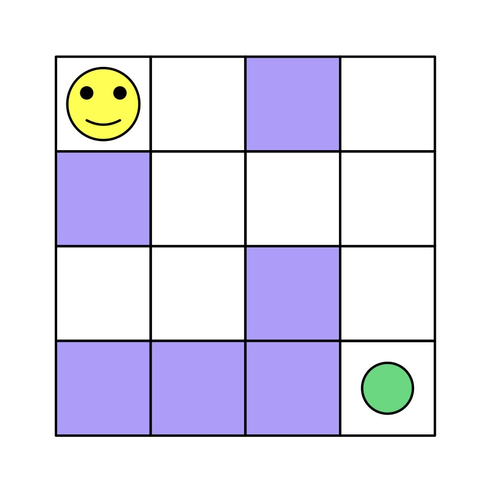

# Maze Solver

This project can be found in [Educative.io](https://www.educative.io/)'s [JavaScript in Detail: From Beginner to Advanced](https://www.educative.io/courses/javascript-in-detail-from-beginner-to-advanced) course.


## Problem Description
Outline to a series of problems that will be solved with a maze solver.


## Topics Covered
- [Background](#background)
- [Task](#task)
  - [Sub-tasks](#sub-tasks)
    1. [Creating a maze](#1-creating-a-maze)
    2. [Creating random maze](#2-creating-random-maze)
    3. [Creating MazeSolver](#3-creating-mazesolver)
    4. [Finding traversable indices](#4-finding-traversable-indices)
    5. [Finding neighboring traversable indices](#5-finding-neighboring-traversable-indices)
    6. [Checking if an index is already visited](#6-checking-if-an-index-is-already-visited)
    7. [Final step to check if a maze is solvable](#7-final-step-to-check-if-a-maze-is-solvable)


## Background
A gaming company **YAMCO** created a game called **Mind the App** where players solve puzzles to advance to the next level. Part of the game called **BACMAN** is designed for players to complete a maze in record time. Some designers are struggling to create multiple variants of the maze. Some mazes are unsolvable while others are too easy. The chief of designers has assigned you to create a solution in **JavaScript** which can take or generate any maze to tell if it is solvable.


## Task
Use your **JavaScript** knowledge to create a solution which tells if a given maze is or is not solvable. This way, the **chief of designers** can prevent her team from wasting their time on failed mazes.



The above illustration shows the look of a maze. Make a **JavaScript** version of the maze so it can tell whether the maze is solvable or not.


### Sub-tasks
The **sub-tasks** of the project are listed here.


#### 1. Creating a maze
Because we need **JavaScript** to understand the maze, use a **two-dimensional array** where each *index* has a value of `0` or `1`. This will be referred to as grid and will be copied into our version of the maze. Use a **class** called `Grid` which is responsible for copying and maintaining an input **two-dimensional array** into its **property** `grid`.

```javascript
class Grid {
  constructor (arr) {
    this.grid; // copy of arr
    this.printArray; // method to print this.grid
  }
}
```

The **class** is already created with a helper **function** to print the **array** *assigned* to `this.grid`. Your task is to create a *copy* of the input **array** `arr` and *assign* it to `this.grid`.


#### 2. Creating random maze
Sometimes, there won’t be an **array** to give to the **constructor**. So, we want our **class** to generate a *random* **two-dimensional array** instead.

```javascript
class Grid {
  constructor (arr) {
    this.grid; // random array when arr is undefined
    this.printArray; // method to print this.grid
  }
}
```

For the same **class** `Grid`, if the `arr` argument is `undefined`, we *assign* it to a **two-dimensional array** of **6x6 dimensions**. There, each *index is randomly assigned* to `1` or `0`.


#### 3. Creating `MazeSolver`
To solve the maze, create a **class** `MazeSolver`.

```javascript
class MazeSolver {
  constructor (arr) {
    this.grid; // assigned to an array depending on arr value
    this.printArray; // method to print this.grid
  }
}
```

Because it will have all **properties** of `Grid`, derive the `MazeSolver` class from `Grid` class. This step ensuring that we implement **inheritance** properly.


#### 4. Finding traversable indices
Before traversing any *index*, make sure that a given *index* is valid. For this, implement a **method** `canTraverse`.

```javascript
class MazeSolver {
  constructor (arr) {
    this.grid; // assigned to an array depending on arr value
    this.printArray; // method to print this.grid
    this.canTraverse; // method to see if (x,y) are traversable in this.grid
  }
}
```

The method is responsible for telling for *indices* `x` and `y` that if they are valid or not by returning a **boolean** value.


#### 5. Finding neighboring traversable indices
For any *index* in the **two-dimensional array** (`this.grid`), we need to know what *indices* we can move into the **array**. This is where `getNeighbors` **method** comes in.

```javascript
class MazeSolver {
  constructor (arr) {
    this.grid; // assigned to an array depending on arr value
    this.printArray; // method to print this.grid
    this.canTraverse; // method to see if (x,y) are traversable in this.grid
    this.getNeighbors; // method to get a list of traversable neighbors
  }
}
```

The **method** returns an **array** of *indices* that can move from the *source indices*.


#### 6. Checking if an index is already visited
While traversal, we may visit the same indices again and again. To prevent this, maintain an **array** of all *visited* indices. Refer to it when you need to know if an index is visited already. To assist, create another **method** `checkVisited`.

```javascript
class MazeSolver {
  constructor (arr) {
    this.grid; // assigned to an array depending on arr value
    this.printArray; // method to print this.grid
    this.canTraverse; // method to see if (x,y) are traversable in this.grid
    this.getNeighbors; // method to get a list of traversable neighbors
    this.checkVisited; // method to check if an index is visited
  }
}
```

The method returns a **boolean** value depending on if the *index* in `this.grid` is visited by taking an **array** of all *visited indices* and cross-checking.


#### 7. Final step to check if a maze is solvable
With all **helper methods** and a maze ready, we can finally implement a solution, where the **method** `solve` takes the *source* and *target* *indices* and tells if the maze is solvable.

```javascript
class MazeSolver {
  constructor (arr) {
    this.grid; // assigned to an array depending on arr value
    this.printArray; // method to print this.grid
    this.canTraverse; // method to see if (x,y) are traversable in this.grid
    this.getNeighbors; // method to get a list of traversable neighbors
    this.checkVisited; // method to check if an index is visited
    this.solve; // method to try solving the maze with source and target indices
  }
}
```

The **method** *returns* a **boolean** value depending on whether the **function** can solve the maze or not, for the *source* and *target* *indices*.
